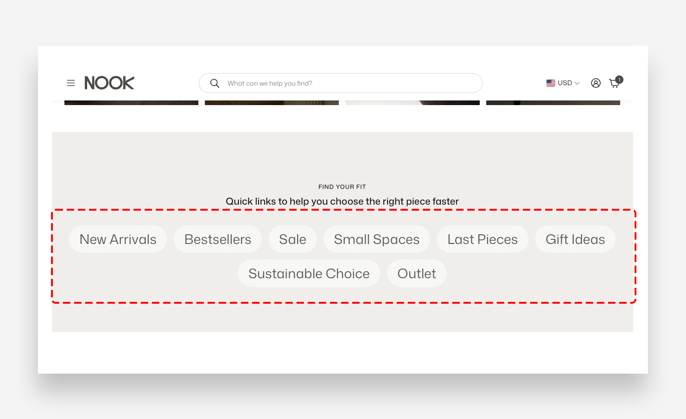

import SectionMeta from '@site/src/components/SectionMeta';

## What is the Pills Navigation section?

<SectionMeta version="v2.4.0" />

The Pills Navigation section displays a collection of clickable pill-shaped buttons, each linking to a page or collection. It is ideal for highlighting key categories, curated selections, or navigation shortcuts in a visually distinctive, tag-like layout.

## Main Settings

### General

- **Headline** — Add an optional heading displayed above the pills.
- **Make section full width** — Enable this toggle to stretch the section to the full width of the screen.

### Pills

- **Pill style** — Choose between Primary and Secondary visual styles for the pill buttons.
- **Text style** — Choose between Body and Heading text styling for the pill labels.
- **Enable custom border radius** — Enable this toggle to apply a custom border radius to the pills and their images.
- **Border and image radius** — Set the corner radius applied to the pill buttons and any images within them. Applied only when Enable custom border radius is enabled.

### Large Screen Version

- **Font size** — Adjust the font size of the pill labels on large screens.
- **Gap between pills** — Set the spacing between individual pill buttons on desktop.
- **Desktop layout** — Set the horizontal alignment of the pills on desktop — Left or Center.

### Mobile Version

- **Font size** — Adjust the font size of the pill labels on mobile devices.
- **Gap between pills** — Set the spacing between individual pill buttons on mobile.
- **Mobile layout** — Set the horizontal alignment of the pills on mobile — Left or Center.

### Pill Colors

- **Background color** — Set the background color of the pill buttons.
- **Text color** — Set the text color of the pill labels.
- **Hover background color** — Set the background color of a pill button on hover. The Transparent value inherits from global settings by default.
- **Hover text color** — Set the text color of a pill label on hover. The Transparent value inherits from global settings by default.

### Colors

The Transparent value is the default and subsequently inherits the value from the global settings.

- **Text color** — Define the global text color for the section.
- **Background color** — Set the background color of the entire section.

### Section Spacing

- **Distance from the top** — Adjust the spacing above the section.
- **Distance from the bottom** — Adjust the spacing below the section.
- **Show custom mobile spacing** — Enable this toggle to set custom spacing values specifically for mobile devices.
- **Distance from the top mobile** — Adjust the spacing above the section on mobile. Applied only when Show custom mobile spacing is enabled.
- **Distance from the bottom mobile** — Adjust the spacing below the section on mobile. Applied only when Show custom mobile spacing is enabled.

## Pill

Each Pill is an individual block within the Pills Navigation section. It contains an optional image, a text label, and a link — displayed together as a single clickable pill button.

### Settings

- **Image** — Upload an optional image to display inside the pill button.
- **Title** — Enter the label text displayed on the pill button.
- **Link** — Set the destination URL or page the pill links to when clicked.

## How to Set Up the Pill Navigation Section

<video width="100%" controls>
  <source src="/img/docs/pills-navigation.webm" type="video/webm" />
</video>